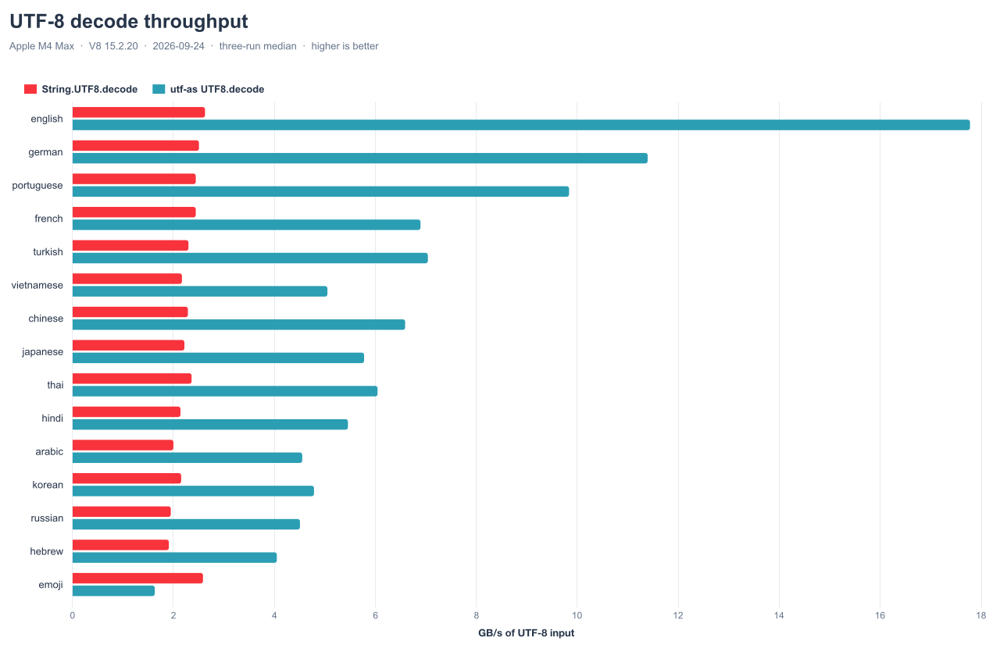
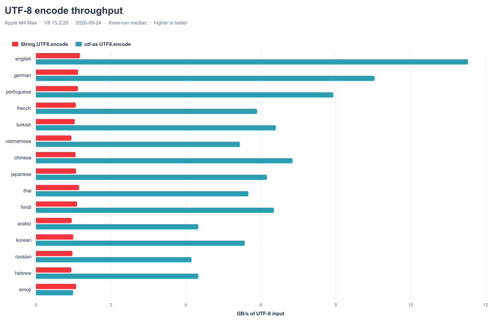
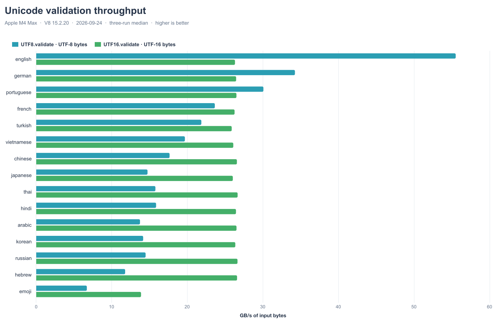
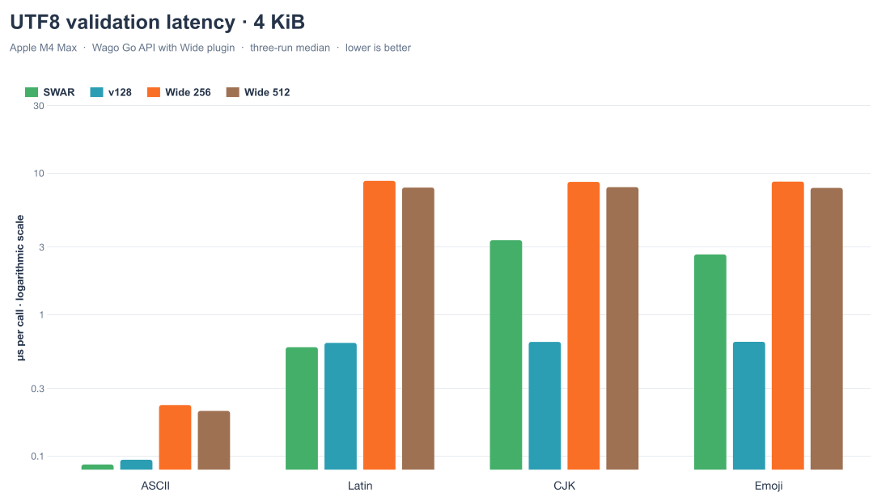
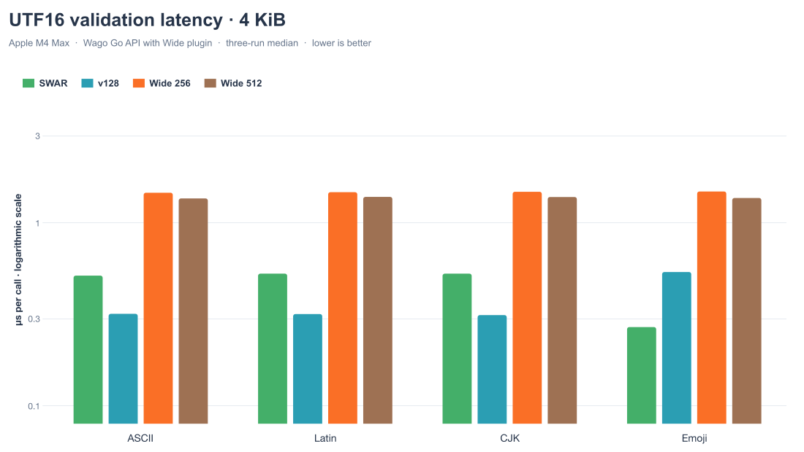
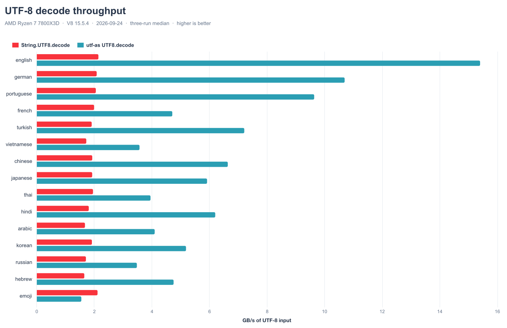
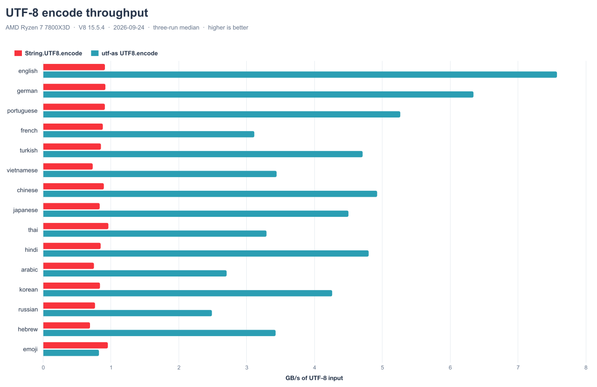
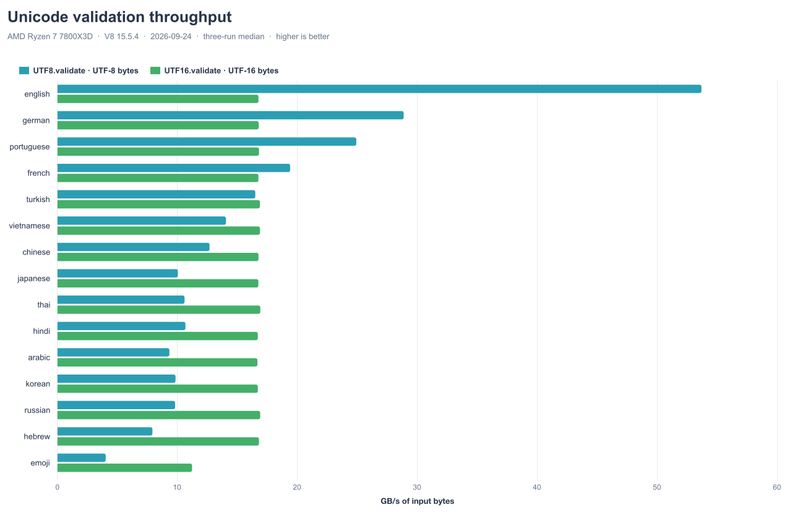
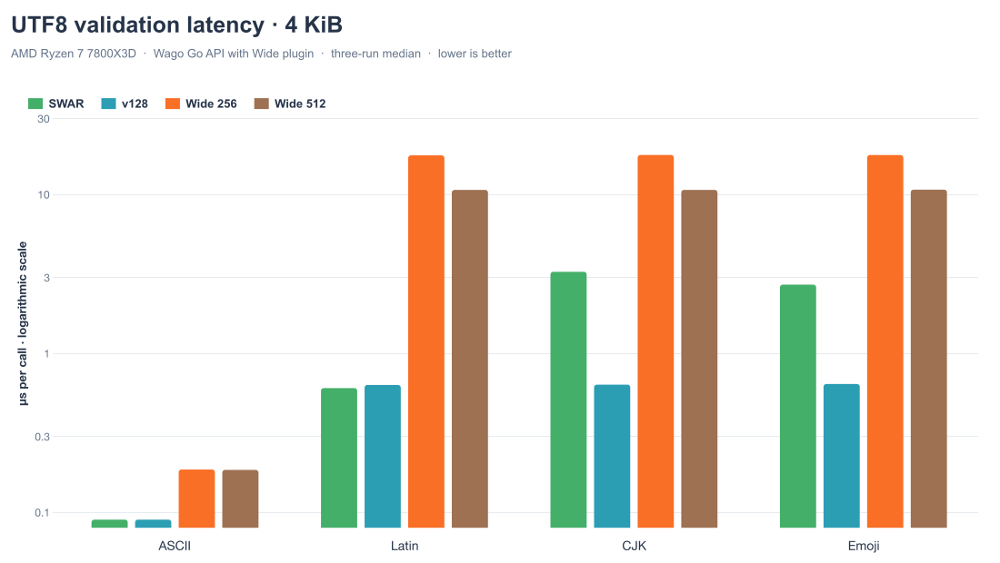
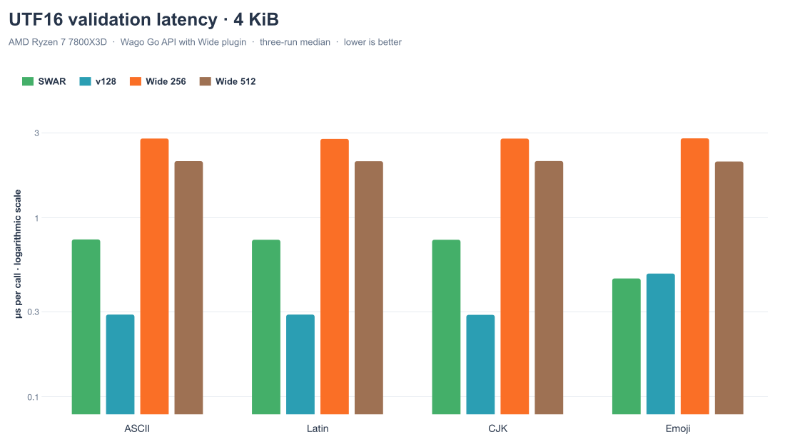

<h1 align="center"><pre>╔═╗ ╔═╗    ╦ ╦ ╔╦╗ ╔═╗
╠═╣ ╚═╗ ══ ║ ║  ║  ╠═ 
╩ ╩ ╚═╝    ╚═╝  ╩  ╩  </pre></h1>

<details>
<summary>Table of Contents</summary>

- [What](#what)
- [Installation](#installation)
- [Usage](#usage)
- [API](#api)
  - [`UTF8`](#utf8)
  - [`UTF16`](#utf16)
  - [Validation](#validation)
  - [Length pre-counters](#length-pre-counters)
  - [Wide kernels](#wide-kernels)
- [Performance](#performance)
  - [Benchmarks](#benchmarks)
  - [Running benchmarks locally](#running-benchmarks-locally)
  - [Charts](#charts)
- [Contributing](#contributing)
- [License](#license)
- [Contact](#contact)

</details>

## What

This library ports simdutf's westmere SSE4 UTF-8 kernels to 128-bit Wasm SIMD and exposes them through the same namespace shape, so you can swap them in by changing the import. It also includes fast validators for both UTF-8 and UTF-16.

- `UTF8.decode` → 2.1–6.7× faster than `String.UTF8.decode` on the HTML payloads
- `UTF8.encode` → 4.3–9.4× faster than `String.UTF8.encode` on the HTML payloads
- `UTF8.validate` → up to 55.4 GB/s on ASCII-heavy HTML; 11.9–34.4 GB/s on other HTML payloads
- `UTF16.validate` → 26.2–26.5 GB/s on the HTML payloads; 13.9 GB/s on dense surrogate pairs

Every operation has a portable **SWAR** (SIMD-within-a-register) path that runs by default and is dispatched to the SIMD kernel only above a size threshold, so small inputs avoid SIMD setup overhead and the library works **with or without `--enable simd`** (the throughput figures above were measured with SIMD enabled).

If you often pass strings between a UTF-8-based host and wasm, consider using `UTF8.decode`/`UTF8.encode` for much faster conversion and less overhead.

## Installation

```bash
npm install utf-as
```

Then import from the package root:

```ts
import { UTF8, UTF16 } from "utf-as";
```

For full throughput, enable [SIMD](https://github.com/WebAssembly/spec/blob/main/proposals/simd/SIMD.md) (it is on by default in the bundled `asconfig.json`):

```bash
--enable simd
```

SIMD is no longer required — with `--disable simd` (or a toolchain without it) the library falls back to its scalar/SWAR paths and still works, just slower on large input.

Enabling [Bulk Memory](https://github.com/WebAssembly/spec/blob/main/proposals/bulk-memory-operations/Overview.md) helps with memory allocation overhead and is not required, but strongly recommended.

```bash
--enable bulk-memory 
```

## Usage

```ts
import { UTF8, UTF16 } from "utf-as";

const bytes = UTF8.encode("Hello, 世界 🌍");      // ArrayBuffer
const back  = UTF8.decode(bytes);                 // string
const valid = UTF8.validate(bytes);               // bool - strict UTF-8 check

// UTF-16 is memcpy under the hood (kept for API parity with String.UTF16)
const wide  = UTF16.encode("Hello");              // ArrayBuffer
const wback = UTF16.decode(wide);                 // string
```

All namespace functions match their Standard Library `String.UTF8` / `String.UTF16` counterparts' signatures - same `ErrorMode` enum (`WTF8` / `REPLACE` / `ERROR`), same `nullTerminated` flag, byte-for-byte stdlib parity on valid input. They are 100% interchangeable.

## API

### `UTF8`

Drop-in for `String.UTF8`. `encode` / `decode` use a **SWAR** transcoder by default. With SIMD enabled, encoding switches to v128 at 16 UTF-16 units; decoding switches at 512 bytes, or at 256 bytes for pure ASCII. A short leading sample routes dense mixed CJK text to the scalar encoder; runs of surrogate pairs use a dedicated SIMD encoder. ASCII input also uses the fast encoder in `REPLACE` and `ERROR` modes; mixed text, lone surrogates, and `nullTerminated` use the scalar fallback in those modes. Both functions compile and run without SIMD.

```ts
UTF8.byteLength(str: string, nullTerminated?: bool): i32
UTF8.encode(str: string, nullTerminated?: bool, errorMode?: UTF8.ErrorMode): ArrayBuffer
UTF8.decode(buf: ArrayBuffer, nullTerminated?: bool): string

// Pointer-based variants - no allocation, caller-owned buffers:
UTF8.encodeUnsafe(str: usize, len: i32, buf: usize, ...): usize
UTF8.decodeUnsafe(buf: usize, len: usize, nullTerminated?: bool): string

// Extensions (not in stdlib):
UTF8.utf16Length(buf: ArrayBuffer): i32
UTF8.utf16LengthUnsafe(buf: usize, len: i32): i32
UTF8.validate(buf: ArrayBuffer): bool
UTF8.validateUnsafe(buf: usize, len: i32): bool
```

Decode is *permissive* - see the [Architecture](#architecture) notes for what that means in practice.

### `UTF16`

Drop-in for `String.UTF16`. UTF-16LE in, UTF-16LE out - all four entry points are memcpy-shaped, kept for API parity so callers can swap our package in without touching call sites.

```ts
UTF16.byteLength(str: string): i32
UTF16.encode(str: string): ArrayBuffer
UTF16.decode(buf: ArrayBuffer): string
UTF16.encodeUnsafe(str: usize, len: i32, buf: usize): usize
UTF16.decodeUnsafe(buf: usize, len: usize): string

// Extensions (not in stdlib):
UTF16.validate(buf: ArrayBuffer): bool
UTF16.validateUnsafe(buf: usize, len: i32): bool
```

### Validation

Strict validators with no stdlib equivalent, exposed on both namespaces. The `*Unsafe` variants take a raw pointer and a **byte** length (`UTF16.validateUnsafe` returns `false` on an odd byte length); the `ArrayBuffer` forms wrap them. Empty input is valid.

```ts
UTF8.validate(buf: ArrayBuffer): bool
UTF8.validateUnsafe(buf: usize, len: i32): bool       // len in bytes

UTF16.validate(buf: ArrayBuffer): bool
UTF16.validateUnsafe(buf: usize, len: i32): bool      // len in bytes
```

- **`UTF8`** (Keiser–Lemire, "Validating UTF-8 in less than one instruction per byte"): rejects lone continuation bytes, overlong sequences, UTF-8-encoded surrogates (`ED A0–BF X`), out-of-range codepoints (>U+10FFFF), and truncated multibyte at EOF.
- **`UTF16`**: rejects lone surrogates - every high surrogate (`D800–DBFF`) must be immediately followed by a low surrogate (`DC00–DFFF`), and vice versa - plus odd byte lengths.

`UTF8.validate` runs a **SWAR** (SIMD-within-a-register, 8 bytes per `u64`) validator by default and dispatches to the SIMD kernel only when SIMD is compiled in (`ASC_FEATURE_SIMD`) **and** the input is ≥ 64 bytes. The two paths agree byte-for-byte. Two consequences:

- **Small inputs are faster.** Below 64 bytes the SWAR path skips the SIMD kernel's 64-byte scratch fill and validates 8 bytes at a time — up to ~3× the throughput of the SIMD path on short ASCII (see the [chart](#charts)).
- **SIMD is now optional for validation.** With `--enable simd` off, `UTF8.validate` compiles and runs through the SWAR path alone (it reaches zero v128 ops).

`UTF16.validate` works the same way (SWAR default, SIMD ≥ 16 bytes / one 8-unit block) and is ~2-2.5× faster than the SIMD path on sub-block input. `UTF8.encode` / `decode` likewise default to SWAR (see [`UTF8`](#utf8)); `UTF16.encode` / `decode` are a plain `memory.copy`. The whole library now compiles and runs with `--enable simd` off.

### Length pre-counters

Output-size pre-computation for sizing destination buffers without performing the full conversion.

```ts
utf16_length_from_utf8(src: usize, len: i32): i32   // → UTF-16 units from UTF-8 bytes
utf8_length_from_utf16(src: usize, len: i32): i32   // → UTF-8 bytes from UTF-16 units (0 on lone surrogate)
```

### Wide kernels

The optional `utf-as/wide` entrypoint exposes 256-bit and 512-bit validators
and length counters. Its block algorithms live in this package and use the
published `as-simd@0.0.2` generic Wide API:

```ts
import {
  validateWide256, validateWide512,
  validateUtf16Wide256, validateUtf16Wide512,
  utf16LengthWide256, utf16LengthWide512,
  utf8LengthWide256, utf8LengthWide512,
} from "utf-as/wide";
```

Validation lengths are in bytes; `utf8LengthWide*` takes UTF-16 code units and
returns zero on malformed input. UTF-8 length counting assumes well-formed
input. Validation and length counting use general vector operations, with
portable fallbacks. `WAGO_PLUGINS=wide` and `--transform as-simd` let the
published transform lower supported operations to Wide imports. Current
compiler output keeps most of these algorithms in portable Wasm, including
the 512-bit validation path. The public `UTF8` and `UTF16` namespaces retain
their SWAR/v128 dispatch.

## Performance

### Benchmarks

These are fresh 2026-09-24 captures of main at `ca0cd0b`. Both machines used
identical simdutf payload bytes. Each V8 value is the median of three one-second
runs. Throughput uses UTF-8 input bytes, except `UTF16.validate`, which uses
UTF-16 bytes. Results from different hosts and V8 versions are shown separately.

#### Apple M4 Max / arm64 / V8 15.2.20

| Payload | `UTF8.decode` | × stdlib | `UTF8.encode` | × stdlib | `UTF8.validate` | `UTF16.validate` |
|---|---:|---:|---:|---:|---:|---:|
| english.html | 17.8 | 6.76× | 11.5 | 9.78× | 55.5 | 26.3 |
| german.html | 11.4 | 4.54× | 9.0 | 8.00× | 34.2 | 26.5 |
| portuguese.html | 9.8 | 4.02× | 7.9 | 7.07× | 30.1 | 26.5 |
| french.html | 6.9 | 2.82× | 5.9 | 5.53× | 23.6 | 26.3 |
| turkish.html | 7.0 | 3.06× | 6.4 | 6.17× | 21.9 | 25.9 |
| vietnamese.html | 5.1 | 2.33× | 5.4 | 5.72× | 19.7 | 26.1 |
| chinese.html | 6.6 | 2.88× | 6.8 | 6.45× | 17.7 | 26.6 |
| japanese.html | 5.8 | 2.60× | 6.2 | 5.73× | 14.7 | 26.0 |
| thai.html | 6.0 | 2.56× | 5.7 | 4.92× | 15.8 | 26.7 |
| hindi.html | 5.5 | 2.55× | 6.4 | 5.77× | 15.9 | 26.4 |
| arabic.html | 4.6 | 2.27× | 4.3 | 4.52× | 13.7 | 26.5 |
| korean.html | 4.8 | 2.22× | 5.6 | 5.58× | 14.2 | 26.4 |
| russian.html | 4.5 | 2.31× | 4.2 | 4.25× | 14.5 | 26.6 |
| hebrew.html | 4.1 | 2.12× | 4.3 | 4.57× | 11.8 | 26.6 |
| emoji.txt | 1.6 | 0.63× | 1.0 | 0.93× | 6.7 | 13.9 |

All throughput cells are GB/s.

#### AMD Ryzen 7 7800X3D / amd64 / V8 15.5.4

| Payload | `UTF8.decode` | × stdlib | `UTF8.encode` | × stdlib | `UTF8.validate` | `UTF16.validate` |
|---|---:|---:|---:|---:|---:|---:|
| english.html | 15.4 | 7.18× | 7.6 | 8.32× | 53.7 | 16.8 |
| german.html | 10.7 | 5.13× | 6.3 | 6.91× | 28.9 | 16.8 |
| portuguese.html | 9.6 | 4.69× | 5.3 | 5.79× | 24.9 | 16.8 |
| french.html | 4.7 | 2.36× | 3.1 | 3.54× | 19.4 | 16.8 |
| turkish.html | 7.2 | 3.77× | 4.7 | 5.53× | 16.5 | 16.9 |
| vietnamese.html | 3.6 | 2.07× | 3.4 | 4.71× | 14.1 | 16.9 |
| chinese.html | 6.6 | 3.44× | 4.9 | 5.50× | 12.7 | 16.8 |
| japanese.html | 5.9 | 3.07× | 4.5 | 5.40× | 10.1 | 16.8 |
| thai.html | 4.0 | 2.02× | 3.3 | 3.42× | 10.6 | 16.9 |
| hindi.html | 6.2 | 3.43× | 4.8 | 5.66× | 10.7 | 16.7 |
| arabic.html | 4.1 | 2.44× | 2.7 | 3.61× | 9.3 | 16.7 |
| korean.html | 5.2 | 2.70× | 4.3 | 5.08× | 9.9 | 16.7 |
| russian.html | 3.5 | 2.03× | 2.5 | 3.25× | 9.8 | 16.9 |
| hebrew.html | 4.8 | 2.87× | 3.4 | 4.96× | 7.9 | 16.8 |
| emoji.txt | 1.6 | 0.73× | 0.8 | 0.86× | 4.0 | 11.2 |

All throughput cells are GB/s.

`emoji.txt` is the conversion outlier on both machines: its dense
supplementary-plane sequences make `UTF8.encode` and `UTF8.decode` slower than
the standard library.

The optional Wide validators were measured with the same freshly compiled Wasm
module on both hosts through the same Wago Go API and Wide plugin source. Each
call validates 4 KiB. Values are microseconds per call, calculated from the
median of three benchmark samples with 100 validations per operation. Lower is
better.

#### Wide validation / Apple M4 Max / arm64

**UTF8**, µs per 4 KiB call:

| Input | SWAR | v128 | Wide 256 | Wide 512 |
|---|---:|---:|---:|---:|
| ASCII | 0.087 | 0.094 | 0.229 | 0.208 |
| Latin | 0.587 | 0.630 | 8.801 | 7.894 |
| CJK | 3.352 | 0.640 | 8.656 | 7.945 |
| Emoji | 2.658 | 0.641 | 8.701 | 7.847 |

**UTF16**, µs per 4 KiB call:

| Input | SWAR | v128 | Wide 256 | Wide 512 |
|---|---:|---:|---:|---:|
| ASCII | 0.516 | 0.319 | 1.465 | 1.363 |
| Latin | 0.529 | 0.318 | 1.475 | 1.390 |
| CJK | 0.529 | 0.314 | 1.483 | 1.388 |
| Emoji | 0.270 | 0.540 | 1.488 | 1.371 |

#### Wide validation / AMD Ryzen 7 7800X3D / amd64

**UTF8**, µs per 4 KiB call:

| Input | SWAR | v128 | Wide 256 | Wide 512 |
|---|---:|---:|---:|---:|
| ASCII | 0.090 | 0.090 | 0.186 | 0.185 |
| Latin | 0.605 | 0.633 | 17.618 | 10.676 |
| CJK | 3.260 | 0.636 | 17.709 | 10.681 |
| Emoji | 2.706 | 0.642 | 17.688 | 10.716 |

**UTF16**, µs per 4 KiB call:

| Input | SWAR | v128 | Wide 256 | Wide 512 |
|---|---:|---:|---:|---:|
| ASCII | 0.760 | 0.289 | 2.786 | 2.083 |
| Latin | 0.757 | 0.289 | 2.773 | 2.081 |
| CJK | 0.757 | 0.288 | 2.784 | 2.086 |
| Emoji | 0.460 | 0.490 | 2.792 | 2.073 |

The published `as-simd` transform lowers only three v256 operations and no
v512 operations in this module. Most Wide validation work therefore runs in
portable Wasm; v128 remains faster on these inputs.

### Charts

The SVG and PNG charts use the checked-in snapshots under
[`bench/results`](./bench/results). Regenerate them with
`npm run charts:release`. The Wide charts use a logarithmic time axis to keep
all four implementations visible.

#### Apple M4 Max (arm64)











#### AMD Ryzen 7 7800X3D (amd64)











### Running benchmarks locally

```bash
npm install
npm run bench:fetch              # one-time: pulls simdutf payloads into fixtures/simdutf/
npm run bench:simdutf            # validator over the 18 payloads
npm run bench:vs-stdlib          # head-to-head stdlib UTF8 vs ours (encode + decode)
npm run bench:summary            # markdown summary of results from build/logs/as/<runtime>/
npm run charts                   # build + serve ./charts on :3000
```

Multi-runtime - pass `--wavm` or `--wazero` to any bench command (binaries need to be in PATH):

```bash
npm run bench -- --wavm utf-vs-stdlib
npm run charts:build -- --wavm
```

The V8 runner loads payload fixtures via a `readFile` hostcall; WASI runtimes have none, so the harness packs the fetched fixtures and pipes them in on stdin (`scripts/pack-simdutf-fixtures.mjs`). Run `npm run bench:fetch` first for any payload bench under `--wavm`/`--wazero`.

Optional memory tracking via [`as-heap-analyzer`](https://www.npmjs.com/package/as-heap-analyzer):

```bash
npm run bench -- --memory utf-vs-stdlib
```

## Contributing

PRs are welcome - open an issue first if it's a non-trivial change so we can sync on the approach. Run `npm test` and `npm run bench:simdutf` before submitting; the bench delta versus baseline is a useful thing to include in the PR description.

## License

This project is distributed under an open source license. Work on this project is done by passion, but if you want to support it financially, you can do so by making a donation to the project's [GitHub Sponsors](https://github.com/sponsors/JairusSW) page.

You can view the full license using the following link: [License](./LICENSE)

## Contact

Please send all issues to [GitHub Issues](https://github.com/JairusSW/json-as/issues) and to converse, please send me an email at [me@jairus.dev](mailto:me@jairus.dev)

- **Email:** Send me inquiries, questions, or requests at [me@jairus.dev](mailto:me@jairus.dev)
- **GitHub:** Visit the official GitHub repository [Here](https://github.com/JairusSW/json-as)
- **Website:** Visit my official website at [jairus.dev](https://jairus.dev/)
- **Discord:** Contact me at [My Discord](https://discord.com/users/600700584038760448) or on the [AssemblyScript Discord Server](https://discord.gg/assemblyscript/)
